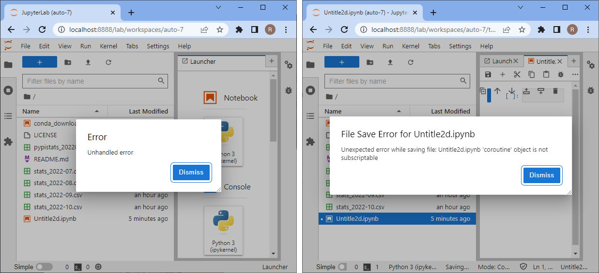

# Course preparation
Before attending the course, please install conda on your computer as explained in this [blog post](https://biapol.github.io/blog/johannes_mueller/anaconda_getting_started/). Furthermore, please install [devbio-napari](https://github.com/haesleinhuepf/devbio-napari#installation) and [Github desktop](https://desktop.github.com/).

When you are done, you can test your setup by executing these commands from the command line:
```
conda activate devbio-napari-env

naparia
```

After Napari opens, click the menu `File > Open Samples > clEsperanto > blobs (from ImageJ)`. In the Panel on the right click on the `Label` button. If Napari then looks like this, you are ready to go:


## Troubleshooting: Errors in Jupyter lab

In case you installed devbio-napari between approximately December 6st and December 11th, there are error messages appearing in Jupyter lab such as those shown below ([potentially related to this](https://github.com/jupyter-server/jupyter_server/issues/1127)).



This can be fixed by calling this from inside the `devbio-napari-env` environment:

```
mamba install jupyter_server=1.23.3 -c conda-forge
```

## Troubleshooting: Napari jumping out of the screen

When using some plugins, the Napari window increases and jumps out of the screen. In this case, downgrade Napari to version 0.4.15:

```
mamba install napari=0.4.15 -c conda-forge
```


## Troubleshooting: Graphics cards drivers

In case error messages contains "ImportError: DLL load failed while importing cl: The specified procedure could not be found" [see also](https://github.com/clEsperanto/pyclesperanto_prototype/issues/55) or ""clGetPlatformIDs failed: PLATFORM_NOT_FOUND_KHR", please install recent drivers for your graphics card and/or OpenCL device. Select the right driver source depending on your hardware from this list:

* [AMD drivers](https://www.amd.com/en/support)
* [NVidia drivers](https://www.nvidia.com/download/index.aspx)
* [Intel CPU OpenCL drivers](https://www.intel.com/content/www/us/en/developer/articles/tool/opencl-drivers.html#latest_CPU_runtime)
* [Microsoft Windows OpenCL support](https://www.microsoft.com/en-us/p/opencl-and-opengl-compatibility-pack/9nqpsl29bfff)

In case installation didn't work in the first attempt, you may have to call this command line to reset the napari configuration:

```
napari --reset
```
