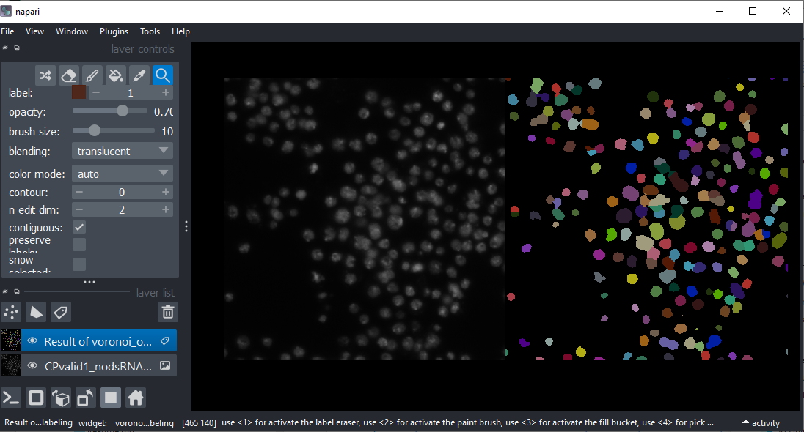
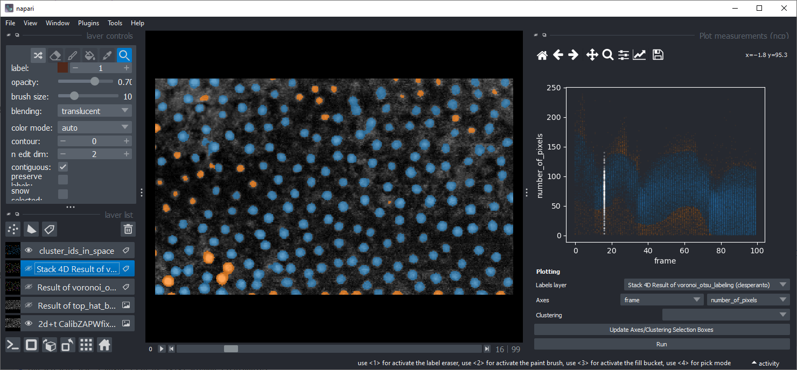
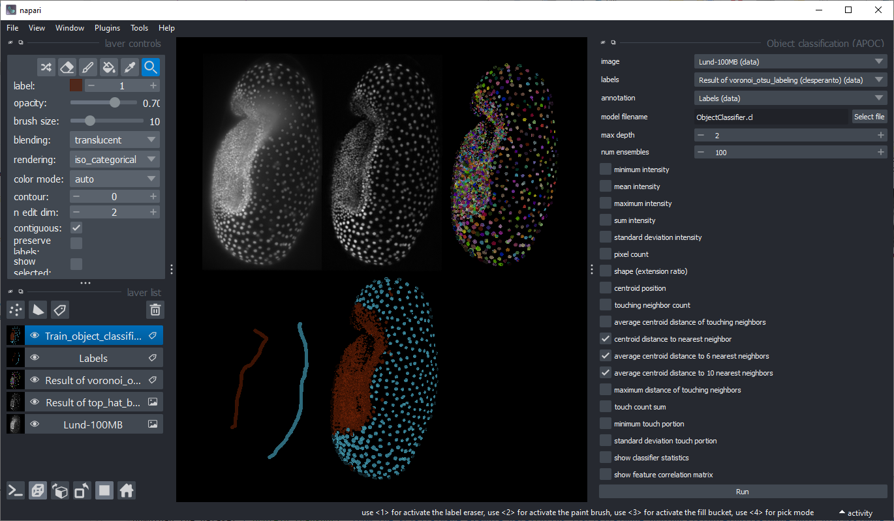
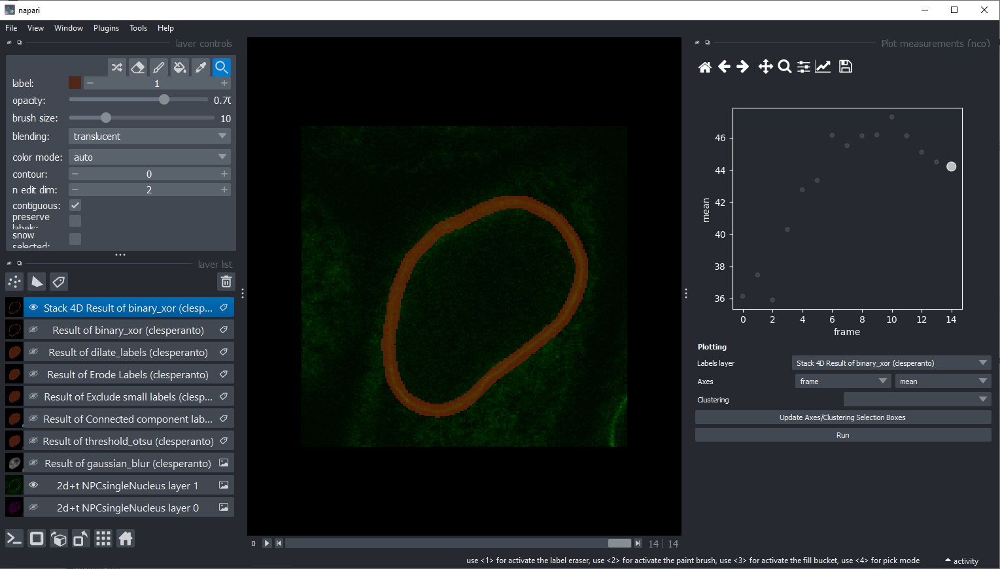
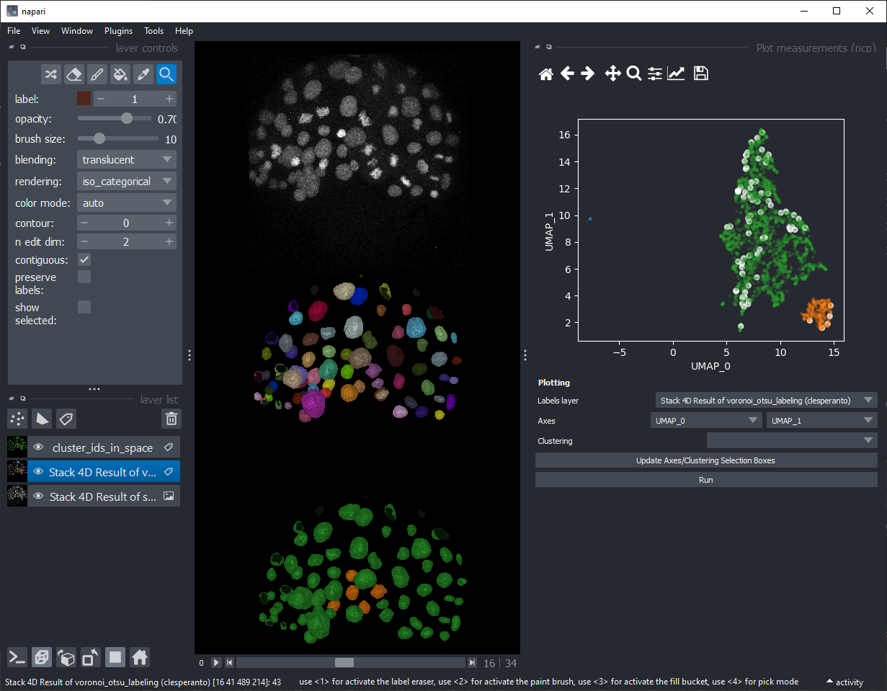

# Potential group projects

During day 3 & 4 you will work in groups on a project of your choice. You can choose from the following projects:

## Project 1: Nuclei count

Download the [BBBC002](https://bbbc.broadinstitute.org/BBBC002) dataset 
([Carpenter et al., Genome Biology, 2006](http://genomebiology.com/2006/7/10/R100) from the 
Broad Bioimage Benchmark Collection [Ljosa et al., Nature Methods, 2012](http://dx.doi.org/10.1038/nmeth.2083)) and count the nuclei. 
Compare the nuclei count with the provided ground truth.

Hints: 
* Develop the image processing workflow in a Jupyter notebook.
* Put the workflow in a Python function and run it in a for-loop to analyze all images.
* Be brave scientists. When optimizing your image-analysis workflow, keep a test set of images separate to later measure quality ([cross validation](https://en.wikipedia.org/wiki/Cross-validation_(statistics))).

## Project 2: Nuclei size distribution

Download the [`CalibZAPWfixed` dataset](https://github.com/clEsperanto/clesperanto_example_data/blob/main/CalibZAPWfixed_000154_max.tif) and segment the nuclei.
Measure the size of the nuclei (e.g. number of pixels per nucleus) and plot these values over time. Also plot the number of nuclei over time.

Hints: 
* Develop the image processing workflow in a Jupyter notebook.
* Put the workflow in a Python function and run it in a for-loop to analyze all images.
* Determine the quality of the segmentation and counting algorithm.

## Project 3: 3D Nuclei classification

Download the [Tribolium castaneum data set "Lund"](https://github.com/clEsperanto/clesperanto_example_data/blob/main/Lund-100MB.tif) and segment the nuclei. 
Classify the nuclei according to their properties so that embryo and serosa nuclei can be distinguished.

Hints:
* The dataset has a voxel size of 1x1x1 micron (isotropic).
* Develop the image processing workflow in a Jupyter notebook.
* When annotating regions for machine learning in 3D, make sure only a single frame is loaded into Napari.
* Put the workflow in a Python function and run it in a for-loop to analyze all frames.

Note: For reproducible analysis, you may want to program that workflow. 
However, processing a single time frame is also possible interactively in Napari.

## Project 4: Protein transport

Download the dataset [`protein transport` from the scikit-image example data](https://scikit-image.org/docs/stable/api/skimage.data.html#skimage.data.protein_transport).
Segment the nucleus in the time series and create a binary image of the nuclear envelope. 
Use this binary image to measure and plot the intensity over time.

Hints:
* Read [Kota Miura, "Measurements of Intensity Dynamics at the Periphery of the Nucleus"](https://link.springer.com/chapter/10.1007/978-3-030-22386-1_2)
* Develop the image processing workflow in a Jupyter notebook.
* Put the workflow in a Python function and run it in a for-loop to analyze all frames.

Note: For reproducible analysis, you may want to program that workflow. 
However, it is also possible to do the entire analysis interactively in Napari.

## Project 5: Clustering nuclei over time

Download the first 35 timepoints of the [Platynereis dataset](https://doi.org/10.5281/zenodo.1063531) by [B. Duygu Ozpolat et al. (2017)](https://elifesciences.org/articles/30463), licensed [CC-BY](https://creativecommons.org/licenses/by/4.0/legalcode).
Segment the nuclei and measure their size, intensity and shape over time.
Load the resulting 3D+t labels and the corresponding measurements into Napari and use the napari-clusters-plotter to generate a UMAP from this dataset.
Explore the data and figure out which parameters make distinct groups of cells. E.g. try to explain why the orange nuclei in the example shown below are different from the others.

Hints:
* Make the dataset isotropic before segmenting the nuclei and cells. Many segmentation algorithms have data isotropy as prerequisite.
* Develop the image processing workflow in a Jupyter notebook.
* Put the workflow in a Python function and run it in a for-loop to analyze all images. Save the resulting label images and measurements in a folder.
* Write another Jupyter notebook that loads all the raw image data, segmentation labels and measurements into Napari.

All steps are possible using Python. However, the last step, parameter exploration, should be done interactively.

## Project 6 Work on your own data

You can also work on imaging data you brought with you. This is recommended in case you work with datasets and scientific questions similar to the use-cases shown above as our teaching materials are centered around those.

## Group presentations

On Friday afternoon, you will present your results to the other groups. 
Nobody will judge if you found the best segmentation algorithm. 
It matters more if you measured the quality of your segmentation algorithm. 
When presenting your work, make sure others can reproduce your science. 
Give installation instructions and describe your protocol. 
Show example results and argue how they can be interpreted. 
